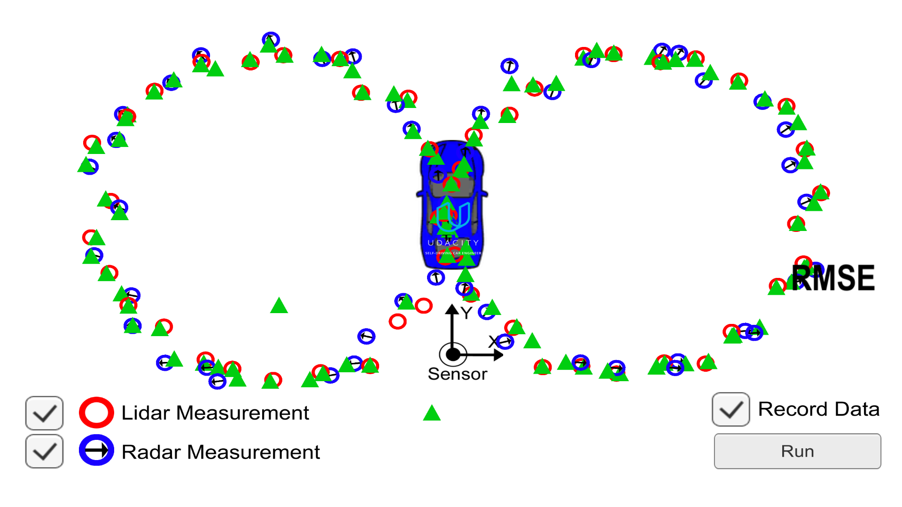
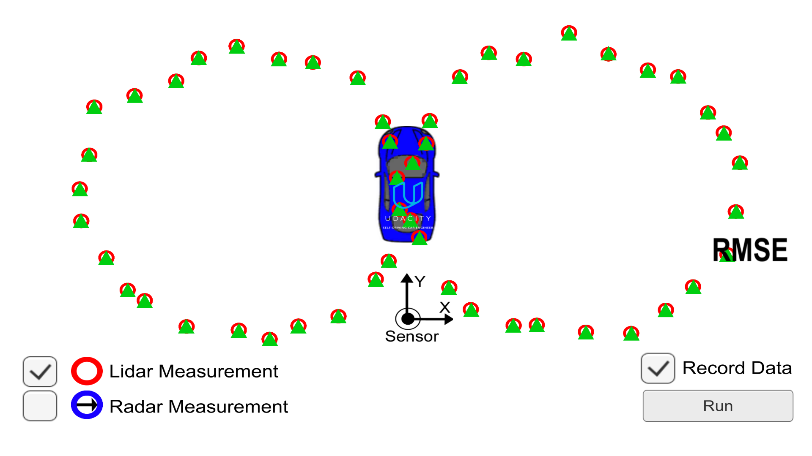

# SelfDrivingCar-P6-Kalman-Filter
  
Udacity CarND Term 2  - Project 1 
---

## Dependencies

* cmake >= 3.5
 * All OSes: [click here for installation instructions](https://cmake.org/install/)
* make >= 4.1
  * Linux: make is installed by default on most Linux distros
  * Mac: [install Xcode command line tools to get make](https://developer.apple.com/xcode/features/)
  * Windows: [Click here for installation instructions](http://gnuwin32.sourceforge.net/packages/make.htm)
* gcc/g++ >= 5.4
  * Linux: gcc / g++ is installed by default on most Linux distros
  * Mac: same deal as make - [install Xcode command line tools]((https://developer.apple.com/xcode/features/)
  * Windows: recommend using [MinGW](http://www.mingw.org/)

## Basic Build Instructions

1. Clone this repo.
2. Make a build directory: `mkdir build && cd build`
3. Compile: `cmake .. && make`
4. Run it: `./ExtendedKF path/to/input.txt path/to/output.txt`. You can find
   some sample inputs in 'data/'.
    - eg. `./ExtendedKF ../data/sample-laser-radar-measurement-data-1.txt output.txt`

## Files in the `src` Folder

* `main.cpp` - reads in data, calls a function to run the Kalman filter, calls a function to calculate RMSE
* `FusionEKF.cpp` - initializes the filter, calls the predict function, calls the update function
* `kalman_filter.cpp` - defines the predict function, the update function for lidar, and the update function for radar
* `tools.cpp` - function to calculate RMSE and the Jacobian matrix

## How the Files Relate to Each Other
Here is a brief overview of what happens when you run the code files:

* `Main.cpp` reads in the data and sends a sensor measurement to FusionEKF.cpp
* `FusionEKF.cpp` takes the sensor data and initializes variables and updates variables. The Kalman filter equations are not in this file. `FusionEKF.cpp` has a variable called `ekf_`, which is an instance of a KalmanFilter class. The `ekf_` will hold the matrix and vector values. We also use the `ekf_` instance to call the predict and update equations.
* The KalmanFilter class is defined in `kalman_filter.cpp` and `kalman_filter.h`.

## Simulation Results

### RMSE Outputs for the Sample Inputs
* The `px, py, vx, vy` output coordinates have an `RMSE = [0.0651648, 0.0605379, 0.533212, 0.544193]` when using the file: `sample-laser-radar-measurement-data-1.txt`.  
* The `px, py, vx, vy` output coordinates have an `RMSE = [0.185548, 0.190294, 0.47589, 0.805973]` when using the file: `sample-laser-radar-measurement-data-2.txt`.  

### Data Visualization 
The following figures are generated in the [Visualization Tool](https://d17h27t6h515a5.cloudfront.net/topher/2017/March/58d07064_kalman-tracker-mac.app/kalman-tracker-mac.app.zip) provided by Udacity. 
* The first one is the performance of the Kalman filter when inputing both *__Radar__* and *__Lidar__* measurements. 
  
* The second one is the performance of the Kalman filter when inputing only *__Lidar__* measurements.
  
* The third one is the performance of the Kalman filter when inputing only *__Radar__* measurements.
  
From the figures above we can find that the Kalman Filter has better performance (higher accuracy/lower RMSE) on the *__Lidar__* measurement inputs than the *__Radar__* measurement inputs. The reason may be that in the *__Radar__* measurement processing, we use some non-linear function and the Taylor Expansion approximation, and this process may lose some useful information. 

### I provide a [demo video on Youtube](https://youtu.be/CEDF6f-11Gg) which shows the real time performance of the Kalman Filter when the car is driving.  
